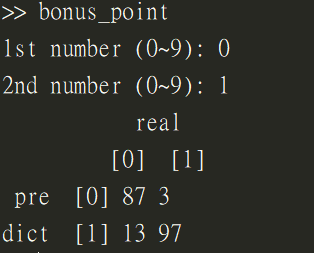
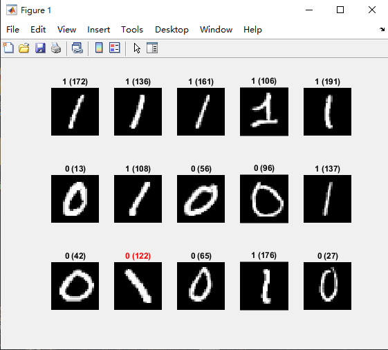
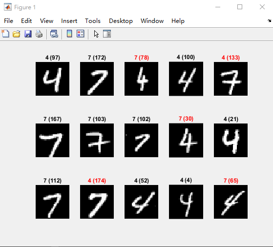

# Simplified CNN Digital Recognition

|Author|Chieh-Ting Chung|
|---|---
|E-mail|sksksk1748@gmail.com

## Memo

* Image Processing , Simplified CNN Digital Recognition

## Requirement Install Step
- Step 1. Open `MATLAB R2020b`
- Step 2. Click `Add-On Explorer` 
- Step 3. Install `Image Processing Toolbox`


## Algorithm
* Simplified CNN Digital Recognition
    1. 將 train1000 裡的要訓練的影像縮小至 8x8

    2. 第一層卷積：用兩種 3x3 濾鏡做卷積運算，運算後的特徵圖大小為 8x8x2。Matlab 可用 `imfilter()`執行卷積運算。

    3. 第一層池化：對步驟 2 的結果 做 2x2 的最大池化(max pooling)，運算後的特徵圖大小為 4x4x2。如果使用 Matlab，可先自己寫一個將 2x2 矩陣的最大值算出的 `max2()`函式，再用 `blkproc()`函式，執行分區的`@max2` 運算。

    4. 第二層卷積：用步驟 2 的兩種 3x3 濾鏡做卷積運算，運算後的特徵圖大小為 4x4x2。

    5. 第二層池化：對步驟 4 的結果做 2x2 的最大池化(max pooling)，運算後的特徵圖大小為 2x2x2。

    6. 平坦化：將 2x2x2 特徵轉成 1x8 的特徵資料，再加常數項 1，成為 1x9 的資料。相當於 y=a1x1+ a2x2+ ..... a8x8+ a9，其中 y 為目標值(0 或 1)，x 是特徵值，a 是待優化的係數。以下將透過線性迴歸，獲得係數矩陣 A=[a1 a2 ... a9]’。

    7. 線性迴歸(取代深度學習)：如果用來辨識’0’與’1’，就讀取前 200 幅影像的資料，線性迴歸自變數 X 的大小是 200x9，依變數 Y 的大小是 200x1，Y 的前 100 個數值設為 0，後 100 的數值設為 1。使用最小平方法 A=(XT*X)‐1*(XT*Y)算出 9x1的係數矩陣。若使用 Matlab，`A = inv(X'*X)*(X'*Y) = X\Y`。

    8. 測試(混淆矩陣)：
    可套用 train 組的 200 個影像特徵資料，或另外用 test 組的 200 個影像特徵資料做評估。首先用 `Yp=X*A` 獲得預測值 Yp，如果前 100 個影像數值低於 0.5，代表’0’被正確判斷，請把數量填入混淆矩陣(1,1)的位置。如果前 100 個影像數值高於 0.5，代表’0’被辨識為’1’，請把數量填入混淆矩陣(2,1)的位置。如果後 100 個影像數值高於 0.5，代表’1’被正確判斷，請把數量填入混淆矩陣(2,2)的位置。如果後 100 個影像數值低於 0.5，代表’0’被辨識為’1’，請把數量填入混淆矩陣(1,2)的位置。

    9. 隨機測試：從這 200 張影像任意選取(`rand()`)15 張，評估其效果，每個圖的標題含預測的數值，以及隨機選取的影像編號(括弧內)。若答對，文字是`藍色`的；若答錯，文字是`紅色`的。

    10. 改寫成能夠讀取任意兩個數值，顯示混淆矩陣，與 15 個隨機選取影像的測試結果。


## Your `~/ImageHW1/` folder should look like this
```
ImageHW1
├── train1000/
│   └── ...
├── test1000/
│   └── ...
├── bonus_point.m
└── ...

```

## Result

* Simplified CNN Digital Recognition
    * 
    * 
    * 
    * 

## Reference

* NTUST , Pei-Li Sun PROFESSOR